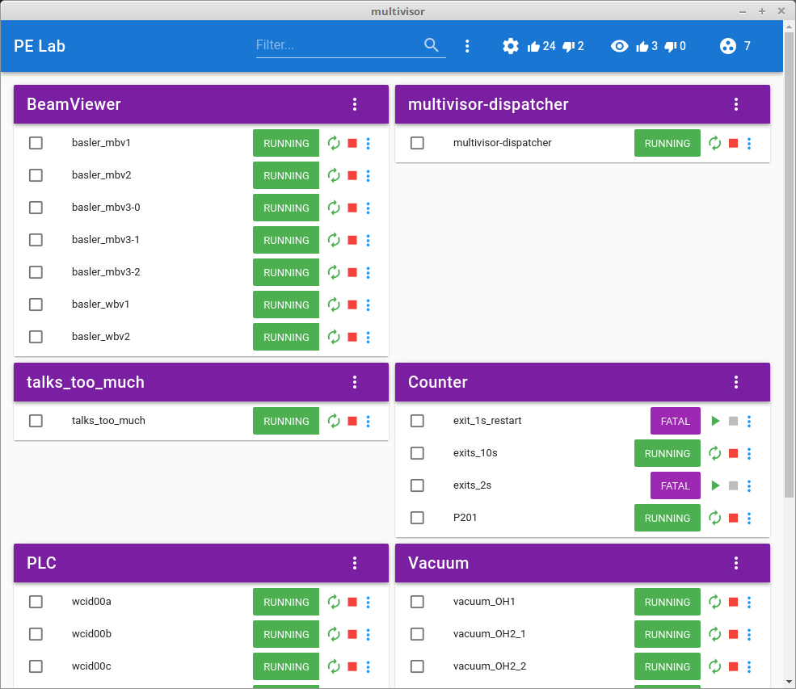

# Multivisor

A centralized supervisor web UI inspired by [cesi](https://github.com/gamegos/cesi).

* Processes status always up to date
* Reactivity through asynchronous actions
* Notifications when state changes
* Have a Single Page App
* Mobile aware
* Powerful filter to quickly see relevant processes

## Running the example from scratch

```bash
# Fetch the project:
git clone git://github.com/tiagocoutinho/multivisor
cd multivisor
# Prepare backend: feel free to use your favorite python virtual env. here
pip install -r requirements.txt

# Install frontend dependencies
npm install
# Build for production with minification
npm run build

# Launch a few supervisors
supervisord -c examples/full_example/supervisord_lid001.conf
supervisord -c examples/full_example/supervisord_lid002.conf
supervisord -c examples/full_example/supervisord_baslid001.conf

# Finally, launch multivisor:
./multivisor -c examples/full_example/multivisor.conf
```
That's it! Start a browser pointing to [localhost:22000](http://localhost:22000) and
you should be able to somthing that looks like this:



## Technologies

The backend runs a [flask](http://flask.pocoo.org/) web server.

The frontend is based on [vue](https://vuejs.org/) + [vuex](https://vuex.vuejs.org/) + [vuetify](https://vuetifyjs.com/).


## Configuration

Multivisor relies on a INI like configuration file (much like supervisor itself). It is usually named *multivisor.conf* and it
must be passed as argument to multivisor when starting the server.

It consists of a `global` section where you can give an optional
name to your multivisor instance (default is *multivisor* and
it will appear on the top left corner of multivisors web page).

To add a new supervisor to the list of supervisors monitored by
multivisor simply add a section `[supervisor:<name>]`. It must
contain at least a `host`. The `port`  is optional and defaults
to `9001`. You can also add a `username` and `password` in case
your supervisor XML-RPC interface configuration requires one.

Here is a basic example:

```toml
[global]
name = Simpsons multivisor

[supervisor:homer1]
host = homer.simpsons.com
#port = 9001
#username = <supervisor user name>
#password = <supervisor password>

[supervisor:homer2]
host = homer.simpsons.com
port = 9002

[supervisor:bart]
host=bart.simpsons.com
```

## Build

``` bash

# install python dependencies
pip install -r requirements.txt

# install dependencies
npm install

# build for production with minification
npm run build


```

## Run

``` bash
# serve at localhost:22000
./multivisor -c multivisor.conf
```

Start a browser pointing to [localhost:22000](http://localhost:22000)

## Development mode

You can run the backend using the webpack dev server to facilitate your development cycle:

First, start multivisor (which listens on 22000 by default):

``` bash
./multivisor -c multivisor.conf
```

Now, in another console, run the webpack dev server (it will
transfer the requests between the browser and multivisor):

``` bash
npm run dev
```

That's it. If you modify `App.vue` for example, you should see the changes directly on your browser.
